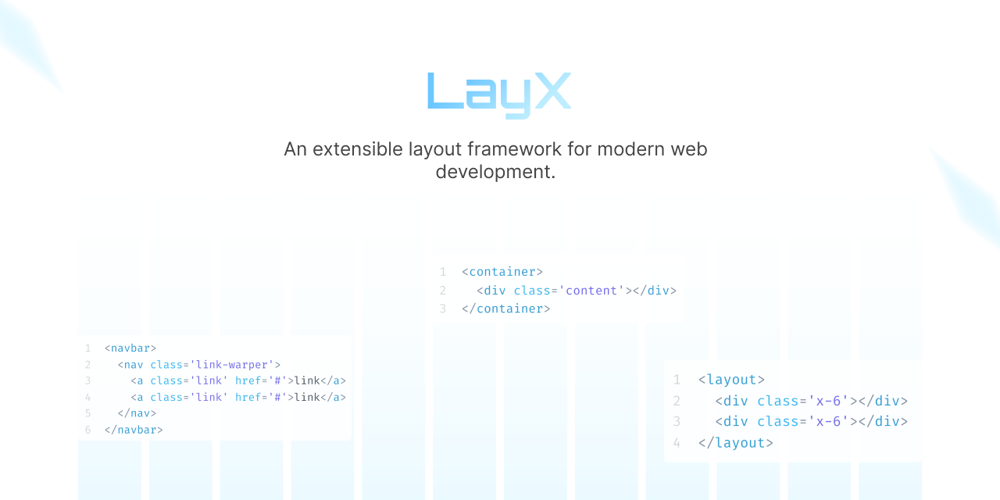

# Layx



Layx is a powerful and extensible layout framework designed for modern web development. It combines advanced layout capabilities with high customizability, making it ideal for both small and large-scale projects. With its modular architecture, Layx offers the flexibility you need to create responsive, scalable, and maintainable web applications. 

> **Note:** Layx is currently in the development stage and available for testing. We welcome your feedback and contributions!

## Table of Contents

- [Layx](#layx)
  - [Table of Contents](#table-of-contents)
  - [🚀 Key Features](#-key-features)
  - [🧠 Approach](#-approach)
  - [🎨 Syntax](#-syntax)
    - [Container](#container)
    - [Main Layout System](#main-layout-system)
    - [Components (e.g., Navbar)](#components-eg-navbar)
  - [📁 Project Structure](#-project-structure)
  - [🛠️ Installation](#️-installation)
  - [🚀 Quick Start Guide](#-quick-start-guide)
  - [📚 Documentation](#-documentation)
  - [🤝 Contributing](#-contributing)
  - [📄 License](#-license)

## 🚀 Key Features

- 📦 **Modular CSS Architecture:** Organize your styles into reusable modules for better maintainability.
- 🎨 **Customizable Components:** Tailor components to fit your project's unique design and functionality needs.
- 📱 **Responsive Grid System:** Build fluid layouts that adapt seamlessly to any screen size.
- ⚡ **Utility-First Classes:** Speed up your development workflow with a comprehensive set of utility classes.
- 🔧 **Built-in JavaScript Components:** Enhance your layouts with interactive features using pre-built JS components.
- 🖼️ **Image Optimization:** Boost performance with the integrated image optimizer.
- 💻 **Command-Line Interface (CLI):** Efficiently manage your projects with our intuitive CLI.
- 🚀 **No Runtime Needed:** Enjoy optimal performance without any runtime dependencies.

## 🧠 Approach

Layx takes inspiration from Bootstrap but adopts a more modern and modular approach:

- **Advanced Layout System:** Utilizes CSS Grid instead of hard-coded numbers, offering greater flexibility and customization.
- **Highly Customizable:** Easily modify layouts using CSS classes and variables.
- **Full-Width Designs:** Layout and container elements can effortlessly extend to screen edges.
- **Modern Web Standards:** Built with the latest CSS features for optimal performance and design capabilities.
- **Zero Runtime Overhead:** Unlike some frameworks, Layx doesn't require any JavaScript runtime, ensuring faster load times and better performance.

## 🎨 Syntax

Layx introduces intuitive syntax for common layout elements:

### Container
```html
<container>
   <div class='content'></div>
</container>
```

### Main Layout System
```html
<layout>
  <div class='x-6'></div>
  <div class='x-6'></div>
</layout>
```

### Components (e.g., Navbar)
```html
<navbar>
  <nav class='link-wrapper'>
    <a class='link' href='#'>link</a>
    <a class='link' href='#'>link</a>
  </nav>
</navbar>
```

## 📁 Project Structure

Layx is organized into a well-structured directory hierarchy:

<details>
<summary>Click to expand project structure</summary>

```
root
    │   index.html
    │   layx.bat
    │
    ├───assets
    │   ├───brand
    │   ├───css
    │   │   │   base.css
    │   │   └───pages
    │   ├───font
    │   ├───images
    │   │   ├───home
    │   │   └───svg
    │   ├───js
    │   │   │   base.js
    │   │   └───pages
    │   └───media
    │       ├───audio
    │       └───video
    │
    ├───config
    │   │   config.css
    │   │   config.html
    │   │   config.mjs
    │   │   node.exe
    │   │   webp.exe
    │   └───preference
    │           snippets.json
    │
    ├───layx
    │   │   layx.css
    │   │   layx.js
    │   ├───assets
    │   │   ├───css
    │   │   │   └───pages
    │   │   └───js
    │   ├───components
    │   │   components.css
    │   ├───main
    │   │   main.css
    │   ├───others
    │   └───utilities
    │       │   utilities.css
    │
    └───pages
```
</details>

Key directories:
- `layx/`: The core of the framework, including components, main styles, and utilities.
- `config/`: Holds configuration files, tools and preferences.
- `assets/`: Here you can put your all assets like CSS, JS, images, and media files.
- `assets/[css|js]/base.[css|js]`: Here you can write your base CSS and JS which are common, it will be added after `layx` 
   CSS or JS in build time. This original CSS or JS file will be moved inside `layx/assets/[css|js]/user_base.[css|js]`.
- `assets/[css|js]/pages/`: For page-specific content. Inside this dir all CSS and JS file will be minified and original one
  moved to `layx/assets/[css|js]/pages/`.

## 🛠️ Installation

To install Layx on your Windows system:

1. [Download the Layx Windows setup](https://github.com/arif891/Layx/releases/download/v0.1.0-alpha/layx-setup-v0.1.0-alpha_win64.zip)
2. Extract the ZIP file contents
3. Run the following command or click `layx.bat`:

    ```bash
    layx install
    ```
4. (Optional) For VS Code users: Add "C:/Preferences/" to your VS Code Emmet extensions Path for Layx syntax support.

## 🚀 Quick Start Guide

1. **Create a New Project:**
   Open your terminal, navigate to your desired folder, and run:
   ```bash
   layx create
   ```

2. **Start Coding:**
   Dive into your new project directory and begin building!

3. **Build Your Project:**
   When you're ready to deploy, run:
   ```bash
   layx build
   ```

4. **Modify Your Project After Build:**
   Need to make changes? Use the `unbuild` command:
   ```bash
   layx unbuild
   ```

## 📚 Documentation

For comprehensive guides and API references, visit our [official documentation](https://layx.dev/docs).

## 🤝 Contributing

We welcome contributions of all kinds! To get started, please read our [Contributing Guide](CONTRIBUTING.md).

## 📄 License

Layx is open source software [licensed as MIT](LICENSE).

---

⭐ If you find Layx helpful, consider giving it a star on GitHub!

[Report Bug](https://github.com/arif891/Layx/issues) · [Request Feature](https://github.com/arif891/Layx/issues) · [Join our Community](https://discord.gg/layx)